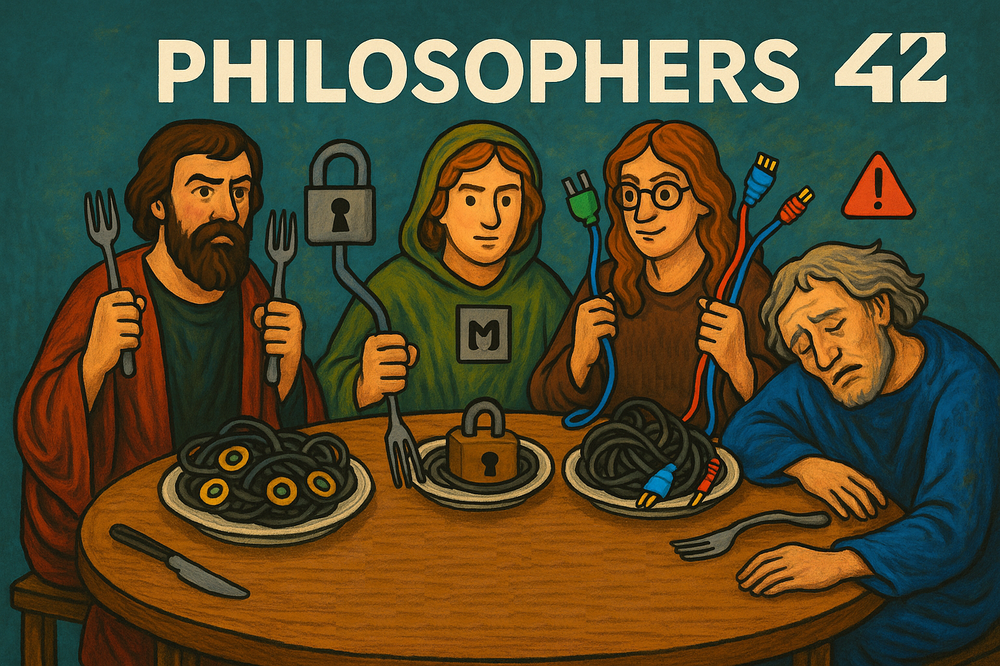

|          Grade           |                           |
|:------------------------:|:-------------------------:|
|  |  |

<br>

---

<details>
<summary>🇫🇷 FRENCH VERSION</summary>

<p align="center">
    Ceci est un <a href="./subject/Philosophers.en.subject.pdf">projet</a> de l'école 42, réalisé en avril 2024.
</p>

## Préambule
Le but est de simuler le problème classique des philosophes autour d'une table, en mettant en œuvre des `threads` et des `mutex` pour gérer la concurrence, sans famine ni interblocage (deadlock).

## Compétences:
- Programmation concurrente avec `pthread`
- Synchronisation avec des `mutex`
- `Détection` et `prévention des deadlocks`
- Gestion précise du temps en `environnement multithread`

## Installation
```bash
git clone https://github.com/N0fish/philosophers.git
cd philosophers
cd philo
make
```

# Exécution
```bash
./philo <nb> <die> <eat> <sleep> [must_eat]
```
nb – nombre de philosophes  
die – temps avant la mort  
eat – temps pour manger  
sleep – temps pour dormir  
must_eat (optionnel) – nombre de fois que chaque philosophe doit manger  

Ne testez pas avec plus de 200 philosophes.

</details>

---

<details>
<summary>🇬🇧 ENGLISH VERSION</summary>

<p align="center">
    This is a <a href="./subject/Philosophers.en.subject.pdf">project</a> at 42 School, completed in April 2024.
</p>

## Preamble
The goal is to simulate the classic Dining Philosophers problem using `threads` and `mutexes` to manage concurrency without starvation or deadlock.

## Skills:
- Multithreading with `pthread`
- Synchronization using `mutex`
- `Deadlock` avoidance and `data race prevention`
- Time management in `concurrent systems`

## Installation
```bash
git clone https://github.com/N0fish/philosophers.git
cd philosophers
cd philo
make
```

# Run
```bash
./philo <nb> <die> <eat> <sleep> [must_eat]
```
nb – number of philosophers  
die – time to die  
eat – time to eat  
sleep – time to sleep  
eat_times (optional) – number of times each philosopher must eat  

Do not test with more than 200 philosophers.

</details>

---

<details>
<summary>🇷🇺 RUSSIAN VERSION</summary>

<p align="center">
    Это <a href="./subject/Philosophers.en.subject.pdf">проект</a> из Школы 42, выполненный в апреле 2024 года.
</p>

## Преамбула
Цель — симулировать классическую задачу об обедающих философах с использованием `потоков` и `мьютексов` для управления конкурентным доступом без взаимоблокировок и голодания.

## Навыки:
- Работа с потоками через `pthread`
- Синхронизация с `mutex`
- Избежание `deadlock` и `гонки данных`
- Управление временем в `многопоточном окружении`

## Установка
```bash
git clone https://github.com/N0fish/philosophers.git
cd philosophers
cd philo
make
```

# Запуск
```bash
./philo <число> <умереть> <есть> <спать> [есть_раз]
```
число - колличество философов  
умереть - время до сметри  
есть - время на еду  
спать - время на сон  
есть_раз(необязательный параметр) - колличество раз каждый философ должен поесть  

Не тестируйте с более чем 200 философами.  
./philo 1 800 200 200 — Философ не должен есть и должен умереть.  
./philo 5 800 200 200 — Ни один философ не должен умереть.  
./philo 5 800 200 200 7 — Ни один философ не должен умереть, и симуляция должна завершиться, когда каждый философ поест как минимум 7 раз.  
./philo 4 410 200 200 — Ни один философ не должен умереть.  
./philo 4 310 200 100 — Один философ должен умереть.  

</details>

---

<br>